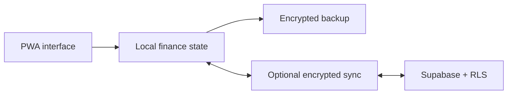

# My Finance Records · V15.2.18

<div align="center">

**A local-first personal and household finance PWA built for privacy, resilience, and everyday use.**

[](https://github.com/nyxdcz/my-finance-record/actions/workflows/quality-pages.yml)


</div>

## At a glance

| Release | Finance schema | Cloud schema | Sync cadence |
| --- | ---: | ---: | ---: |
| **V15.2.18** · Horizontal Project Kanban | **12** | **V3** | **5 minutes** |

The current release turns Project Agenda and Projects into horizontal Kanban boards with full-card drag-and-drop, protected start and Completed columns, custom workflow columns, completion safeguards, and Undo. Project values, payments, revision history, finance calculations, schemas, and sync behavior remain protected.

## What it offers

| Capability | What it means |
| --- | --- |
| Local-first records | Core finance workflows remain available without a cloud dependency. |
| Optional encrypted sync | Multi-device synchronization uses client-side AES-256-GCM encryption with Supabase-compatible storage. |
| Multi-profile support | Personal and household records can stay separated inside one installation. |
| Offline-ready PWA | The app can be installed and used through a service-worker-backed experience. |
| Practical finance tools | Track income, expenses, budgets, accounts, recurring payments, savings goals, and schedules. |
| Compatibility-focused releases | Schema, cache, sync, backup, and restore behavior are treated as protected contracts. |

## Quick start

Requirements: Node.js **22 or newer** and npm.

```bash
git clone https://github.com/nyxdcz/my-finance-record.git
cd my-finance-record
npm ci --ignore-scripts --no-audit --no-fund
npm run dev
```

Open `http://localhost:3000` in a browser. See [`docs/setup/`](docs/setup/) for configuration guidance.

## Architecture



The runtime is being modularized incrementally so installed PWA clients keep working across releases. New code belongs in focused modules under `assets/`; compatibility-sensitive entry points remain stable until a migration is explicitly planned.

<details>
<summary><strong>Repository layout</strong></summary>

| Path | Responsibility |
| --- | --- |
| `.github/` | Actions, dependency updates, ownership, and contribution templates |
| `assets/css/` | Application and responsive styles |
| `assets/js/` | Finance, sync, UI, and feature modules |
| `docs/` | Setup, migration, release, and architecture documentation |
| `icons/` | Runtime icon assets |
| `scripts/` | Runtime preparation, installation, and audit helpers |
| `supabase/` | Database schema, policies, SQL helpers, and Edge Functions |
| `tests/` | Browser, finance, regression, security, sync, and helper tests |
| `vendor/` | Vendored browser dependencies |

See [`docs/architecture/README.md`](docs/architecture/README.md) for module ownership and repository-organization rules.

</details>

## Quality and testing

```bash
npm run quality
npx playwright install chromium
npm run test:browser
npm run quality:ci
```

Tests are grouped by responsibility under `tests/browser`, `tests/finance`, `tests/regression`, `tests/security`, `tests/sync`, and `tests/helpers`.

## Privacy and security

Cloud synchronization is optional. Browser-delivered configuration may contain only Supabase-compatible publishable/anonymous credentials—never a `service_role` key or another privileged secret.

Changes to encryption, finance records, balances, payment state, backups, restores, or storage migrations require regression coverage and a recovery-safe migration plan. Read [`PRIVACY.md`](PRIVACY.md), [`SECURITY.md`](SECURITY.md), and the repository's [security policy](https://github.com/nyxdcz/my-finance-record/security/policy) before reporting sensitive issues.

## Contributing

Contributions should begin with [`CONTRIBUTING.md`](CONTRIBUTING.md). Keep each branch focused, use a Conventional Commit pull-request title, preserve data compatibility, and run the relevant quality checks before requesting review.

## Documentation

| Area | Guide |
| --- | --- |
| Project index | [`docs/README.md`](docs/README.md) |
| Setup | [`docs/setup/`](docs/setup/) |
| Architecture | [`docs/architecture/`](docs/architecture/) |
| Migrations | [`docs/migration/`](docs/migration/) |
| Release operations | [`docs/release/`](docs/release/) |
| Release history | [`CHANGELOG.md`](CHANGELOG.md) |
