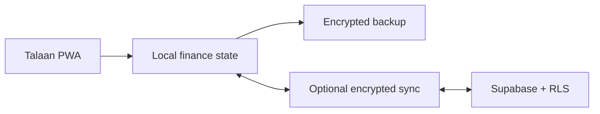

# Talaan · V2.2.0

<div align="center">

**A local-first personal and household finance PWA built for privacy, resilience, and everyday use.**

[](https://github.com/nyxdcz/my-finance-record/actions/workflows/quality-pages.yml)


</div>

## Current release

| Release | Finance schema | Cloud schema | Sync cadence |
| --- | ---: | ---: | ---: |
| **V2.2.0** · Talaan | **12** | **V3** | **5 minutes** |

**Talaan V2.2.0** is the current production release. The application keeps the complete local-first finance workspace, Account Ledger, budgeting, reporting, projects, productivity tools, reminders, encrypted multi-profile synchronization, responsive desktop/phone interface, and offline-ready PWA delivery under the Talaan product name.

The current update adds a local CSV import center with reusable mappings, Philippine date and amount parsing, preview, duplicate detection, reviewed rule suggestions, recovery snapshots, and single-import rollback. CSV imports do not change account balances or Account Ledger entries.

Current release notes are maintained in [`CHANGELOG.md`](CHANGELOG.md).

## What Talaan offers

| Capability | What it means |
| --- | --- |
| Local-first records | Core finance workflows remain available without a cloud dependency. |
| Optional encrypted sync | Multi-device synchronization uses client-side AES-256-GCM encryption with Supabase-compatible storage. |
| Multi-profile support | Personal and household records can stay separated inside one installation. |
| Account Ledger | Transfers, reconciliations, direct spending, payment reversals, and account balances remain auditable. |
| Budgeting and insights | Monthly planning, forecasts, savings allocation, reports, trends, and exports are integrated. |
| Projects and productivity | Project Agenda, revisions, Kanban workflow, Quick Add, search, filters, reminders, and undo/redo are included. |
| Payees and rules | Normalize aliases, preview deterministic categorization, and apply only reviewed, recoverable changes. |
| Local CSV import | Parse, map, preview, deduplicate, and roll back statement records without uploading files or changing balances. |
| Offline-ready PWA | Talaan can be installed and used through a service-worker-backed experience. |
| Compatibility-focused releases | Schema, cache, sync, backup, restore, and finance-data behavior are treated as protected contracts. |

## Quick start

Requirements: Node.js **22 or newer** and npm.

```bash
git clone https://github.com/nyxdcz/my-finance-record.git
cd my-finance-record
npm ci --ignore-scripts --no-audit --no-fund
npm run dev
```

Open `http://localhost:3000` in a browser. See [`docs/setup/`](docs/setup/) for configuration guidance.

## Architecture



The V2.2.0 runtime keeps compatibility-sensitive URLs and stored-data identifiers stable where changing them would create unnecessary PWA or installed-client risk. The product brand is **Talaan**; compatibility identifiers do not define the visible product name.

## Repository layout

| Path | Responsibility |
| --- | --- |
| `.github/` | Actions, dependency updates, ownership, and contribution templates |
| `assets/css/` | Application and responsive styles |
| `assets/js/` | Finance, sync, UI, and feature modules |
| `assets/mascots/` | Budget summary mascot artwork |
| `docs/` | Setup, migration, release, and architecture documentation |
| `icons/` | Runtime icon assets |
| `scripts/` | Runtime preparation, installation, and audit helpers |
| `supabase/` | Database schema, policies, SQL helpers, and Edge Functions |
| `tests/` | Browser, finance, regression, security, sync, and helper tests |
| `vendor/` | Vendored browser dependencies |

See [`docs/architecture/README.md`](docs/architecture/README.md) for module ownership and repository-organization rules.

## Quality and testing

```bash
npm run quality
npx playwright install chromium
npm run test:browser
npm run quality:ci
```

Tests are grouped by responsibility under `tests/browser`, `tests/finance`, `tests/regression`, `tests/security`, `tests/sync`, and `tests/helpers`.

## Privacy and security

Cloud synchronization is optional. Browser-delivered configuration may contain only Supabase-compatible publishable/anonymous credentials—never a `service_role` key or another privileged secret.

Changes to encryption, finance records, balances, payment state, backups, restores, or storage migrations require regression coverage and a recovery-safe migration plan. Read [`PRIVACY.md`](PRIVACY.md), [`SECURITY.md`](SECURITY.md), and the repository's security policy before reporting sensitive issues.

## Contributing

Contributions should begin with [`CONTRIBUTING.md`](CONTRIBUTING.md). Keep each branch focused, use a Conventional Commit pull-request title, preserve data compatibility, and run the relevant quality checks before requesting review.

## Documentation

| Area | Guide |
| --- | --- |
| Project index | [`docs/README.md`](docs/README.md) |
| Setup | [`docs/setup/`](docs/setup/) |
| Architecture | [`docs/architecture/`](docs/architecture/) |
| Migrations | [`docs/migration/`](docs/migration/) |
| Release operations | [`docs/release/`](docs/release/) |
| Current release changelog | [`CHANGELOG.md`](CHANGELOG.md) |
