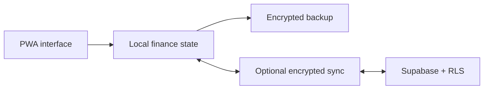

# My Finance Records · V2.0.0

<div align="center">

**A local-first personal and household finance PWA built for privacy, resilience, and everyday use.**

[](https://github.com/nyxdcz/my-finance-record/actions/workflows/quality-pages.yml)


</div>

## At a glance

| Release | Finance schema | Cloud schema | Sync cadence |
| --- | ---: | ---: | ---: |
| **V2.0.0** · Organized Complete | **12** | **V3** | **5 minutes** |

V2.0.0 is the organized production baseline for My Finance Records. The product history now runs cleanly from **V1.0.0 (Created)** through **V2.0.0 (Organized Complete)**, combining the local-first finance system, Account Ledger, budgeting, reporting, projects, productivity, reminders, encrypted multi-profile Cloud Schema V3 synchronization, responsive desktop/phone interface, PWA delivery, and the final Budget & Expenses experience.

The organized release history is maintained in [`CHANGELOG.md`](CHANGELOG.md), with the V1→V2 development roadmap in [`version.md`](version.md). The original detailed V12.19.0–V15.2.24 sequence remains recoverable from Git history and is mapped to the organized milestones in both documents.

## What it offers

| Capability | What it means |
| --- | --- |
| Local-first records | Core finance workflows remain available without a cloud dependency. |
| Optional encrypted sync | Multi-device synchronization uses client-side AES-256-GCM encryption with Supabase-compatible storage. |
| Multi-profile support | Personal and household records can stay separated inside one installation. |
| Account Ledger | Transfers, reconciliations, direct spending, payment reversals, and account balances remain auditable. |
| Budgeting and insights | Monthly planning, forecasts, savings allocation, reports, trends, and exports are integrated. |
| Projects and productivity | Project Agenda, revisions, Kanban workflow, Quick Add, search, filters, reminders, and undo/redo are included. |
| Offline-ready PWA | The app can be installed and used through a service-worker-backed experience. |
| Compatibility-focused releases | Schema, cache, sync, backup, restore, and finance-data behavior are treated as protected contracts. |

## Version roadmap

The organized product history is documented in [`version.md`](version.md):

**V1.0.0 Created → Cloud Sync → Ledger → Budgeting → Insights → Productivity → Reminders → Profiles & Encryption → Mobile Finance → Projects & Navigation → Sync Hardening → Modern PWA → Production Organization → Final Budget & Expenses Polish → V2.0.0 Organized Complete.**

The corresponding release changelog is in [`CHANGELOG.md`](CHANGELOG.md). New releases continue forward from **V2.0.0** using semantic versioning; the old V12–V15 numbering is historical only.

## Quick start

Requirements: Node.js **22 or newer** and npm.

```bash
git clone https://github.com/nyxdcz/my-finance-record.git
cd my-finance-record
npm ci --ignore-scripts --no-audit --no-fund
npm run dev
```

Open `http://localhost:3000` in a browser. See [`docs/setup/`](docs/setup/) for configuration guidance.

## Architecture



The V2 runtime keeps compatibility-sensitive legacy asset filenames where changing them would create unnecessary PWA risk. A filename containing V13, V14, or V15 is therefore a compatibility URL, not the current product version. New work should continue moving toward focused module ownership under `assets/` while preserving explicit migration paths for stored finance data and installed clients.

<details>
<summary><strong>Repository layout</strong></summary>

| Path | Responsibility |
| --- | --- |
| `.github/` | Actions, dependency updates, ownership, and contribution templates |
| `assets/css/` | Application and responsive styles |
| `assets/js/` | Finance, sync, UI, and feature modules |
| `assets/mascots/` | Budget summary mascot artwork |
| `docs/` | Setup, migration, release, and architecture documentation |
| `icons/` | Runtime icon assets |
| `scripts/` | Runtime preparation, installation, and audit helpers |
| `supabase/` | Database schema, policies, SQL helpers, and Edge Functions |
| `tests/` | Browser, finance, regression, security, sync, and helper tests |
| `vendor/` | Vendored browser dependencies |

See [`docs/architecture/README.md`](docs/architecture/README.md) for module ownership and repository-organization rules.

</details>

## Quality and testing

```bash
npm run quality
npx playwright install chromium
npm run test:browser
npm run quality:ci
```

Tests are grouped by responsibility under `tests/browser`, `tests/finance`, `tests/regression`, `tests/security`, `tests/sync`, and `tests/helpers`.

## Privacy and security

Cloud synchronization is optional. Browser-delivered configuration may contain only Supabase-compatible publishable/anonymous credentials—never a `service_role` key or another privileged secret.

Changes to encryption, finance records, balances, payment state, backups, restores, or storage migrations require regression coverage and a recovery-safe migration plan. Read [`PRIVACY.md`](PRIVACY.md), [`SECURITY.md`](SECURITY.md), and the repository's [security policy](https://github.com/nyxdcz/my-finance-record/security/policy) before reporting sensitive issues.

## Contributing

Contributions should begin with [`CONTRIBUTING.md`](CONTRIBUTING.md). Keep each branch focused, use a Conventional Commit pull-request title, preserve data compatibility, and run the relevant quality checks before requesting review.

## Documentation

| Area | Guide |
| --- | --- |
| Project index | [`docs/README.md`](docs/README.md) |
| Setup | [`docs/setup/`](docs/setup/) |
| Architecture | [`docs/architecture/`](docs/architecture/) |
| Migrations | [`docs/migration/`](docs/migration/) |
| Release operations | [`docs/release/`](docs/release/) |
| Organized V1 → V2 roadmap | [`version.md`](version.md) |
| Organized release changelog | [`CHANGELOG.md`](CHANGELOG.md) |
